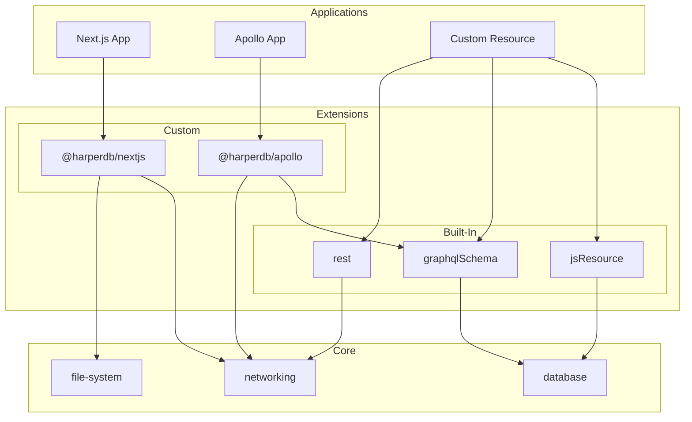

# Applications

Harper is more than a database, it's a distributed clustering platform allowing you to package your schema, endpoints and application logic and deploy them to an entire fleet of Harper instances optimized for on-the-edge scalable data delivery.

In this guide, we are going to explore the evermore extensible architecture that Harper provides by building a Harper application, a fundamental building-block of the Harper ecosystem.

When working through this guide, we recommend you use the [Harper Application Template](https://github.com/HarperDB/application-template) repo as a reference.

Before we get started, let's clarify some terminology that is used throughout the documentation.

**Components** are the high-level concept for any modules that extend the Harper core platform adding additional functionality. The application you will build here is a type of component. In addition to applications, components also encompass extensions.

> We are actively working to disambiguate the terminology. When you see "component", such as in the Operations API or CLI, it generally refers to an application. We will do our best to clarify exactly which classification of a component whenever possible.

**Applications** are best defined as the implementation of a specific user-facing feature or functionality. Applications are built on top of extensions and can be thought of as the end product that users interact with. For example, a Next.js application that serves a web interface or an Apollo GraphQL server that provides a GraphQL API are both applications.

**Extensions** are the building blocks of the Harper component system. Applications depend on extensions to provide the functionality the application is implementing. For example, the built-in `graphqlSchema` extension enables applications to define their databases and tables using GraphQL schemas. Furthermore, the `@harperdb/nextjs` and `@harperdb/apollo` extensions are the building blocks that provide support for building Next.js and Apollo applications.

All together, the support for implementing a feature is the extension, and the actual implementation of the feature is the application.

Extensions can also depend on other extensions. For example, the [`@harperdb/apollo`](https://github.com/HarperDB/apollo) extension depends on the built-in `graphqlSchema` extension to create a cache table for Apollo queries. Applications can then use the `@harperdb/apollo` extension to implement an Apollo GraphQL backend server.



> As of Harper v4.6, a new, **experimental** component system has been introduced called **plugins**. Plugins are a **new iteration of the existing extension system**. They are simultaneously a simplification and an extensibility upgrade. Instead of defining multiple methods (`start` vs `startOnMainThread`, `handleFile` vs `setupFile`, `handleDirectory` vs `setupDirectory`), plugins only have to define a single `handleApplication` method. Plugins are **experimental**, and complete documentation is available on the [plugin API](../../reference/components/plugins) page. In time we plan to deprecate the concept of extensions in favor of plugins, but for now, both are supported.

Beyond applications and extensions, components are further classified as built-in or custom. **Built-in** components are included with Harper by default and can be directly referenced by their name. The `graphqlSchema`, `rest`, and `jsResource` extensions used in the previous application example are all examples of built-in extensions. **Custom** components must use external references, generally npm or GitHub packages, and are often included as dependencies within the `package.json` of the component.

> Harper maintains a number of custom components that are available on `npm` and `GitHub`, such as the [`@harperdb/nextjs`](https://github.com/HarperDB/nextjs) extension or the [`@harperdb/status-check`](https://github.com/HarperDB/status-check) application.

Harper does not currently include any built-in applications, making "custom applications" a bit redundant. Generally, we just say "application". However, there is a multitude of both built-in and custom extensions, and so the documentation refers to them as such. A complete list of built-in extensions is available in the [Built-In Extensions](../../reference/components/built-in-extensions) documentation page, and the list of custom extensions and applications is available below.

This guide is going to walk you through building a basic Harper application using a set of built-in extensions.

> The Reference -> Components section of the documentation contains a [complete reference for all aspects of components](../../reference/components), applications, extensions, and more.

## Custom Functionality with JavaScript

[The getting started guide](/learn/) covers how to build an application entirely through schema configuration. However, if your application requires more custom functionality, you will probably want to employ your own JavaScript modules to implement more specific features and interactions. This gives you tremendous flexibility and control over how data is accessed and modified in Harper. Let's take a look at how we can use JavaScript to extend and define "resources" for custom functionality. In Harper, data is accessed through our [Resource API](../../reference/resources/), a standard interface to access data sources, tables, and make them available to endpoints. Database tables are `Resource` classes, and so extending the function of a table is as simple as extending their class.

To define custom (JavaScript) resources as endpoints, we need to create a `resources.js` module (this goes in the root of your application folder). And then endpoints can be defined with Resource classes that `export`ed. This can be done in addition to, or in lieu of the `@export`ed types in the schema.graphql. If you are exporting and extending a table you defined in the schema make sure you remove the `@export` from the schema so that don't export the original table or resource to the same endpoint/path you are exporting with a class. Resource classes have `static` methods that correspond to standard HTTP/REST methods, like `get`, `post`, `patch`, and `put` to implement specific handling for any of these methods (for tables they all have default implementations). Let's add a property to the dog records when they are returned, that includes their age in human years. To do this, we get the `Dog` class from the defined tables, extend it (with our custom logic), and export it:

```javascript
// resources.js:
const { Dog } = tables; // get the Dog table from the Harper provided set of tables (in the default database)

export class DogWithHumanAge extends Dog {
	async static get(target) {
		const record = await super.get(target);
		return {
			...record, // include all properties from the record
			humanAge: 15 + record.age * 5, // silly calculation of human age equivalent
		};
	}
}
```

Here we exported the `DogWithHumanAge` class, which directly maps to the endpoint path (exported with the same name). Therefore, now we have a `/DogWithHumanAge/<dog-id>` endpoint based on this class, just like the direct table interface that was exported as `/Dog/<dog-id>`, but the new endpoint will return objects with the computed `humanAge` property. The `return super.get(target)` call at the end allows for any request target information (like query parameters) to be applied to the `get`, allowing metadata or queries to be pass through.

Often we may want to incorporate data from other tables or data sources in your data models. Next, let's say that we want a `Breed` table that holds detailed information about each breed, and we want to add that information to the returned dog object. We might define the Breed table as (back in schema.graphql):

```graphql
type Breed @table {
	name: String @primaryKey
	description: String @indexed
	lifespan: Int
	averageWeight: Float
}
```

We use the new table's (static) `get()` method to retrieve a breed by id. Harper will maintain the current context, ensuring that we are accessing the data atomically, in a consistent snapshot across tables. This provides:

1. Automatic tracking of most recently updated timestamps across resources for caching purposes
2. Sharing of contextual metadata (like user who requested the data)
3. Transactional atomicity for any writes (not needed in this get operation, but important for other operations)

The resource methods are automatically wrapped with a transaction and will automatically commit the changes when the method finishes. This allows us to fully utilize multiple resources in our current transaction. With our own snapshot of the database for the Dog and Breed table we can then access data like this:

```javascript
//resource.js:
const { Dog, Breed } = tables; // get the Breed table too
export class DogWithBreed extends Dog {
	static async get(target) {
		// get the Dog record
		const record = await super.get(target);
		// get the Breed record
		let breedDescription = await Breed.get(record.breed);
		return {
			...record,
			breedDescription,
		};
	}
}
```

The call to `Breed.get` will return a record from the `Breed` table as specified by the provided id/primary key. Like the `Dog` record, we can directly use this object or copy properties.

We may also want to customize access to this data. By default, the `target` has a `checkPermission` property that indicates that the table's `get` method will check if there is a valid user with access to a table before returning a record (and throw an `AccessViolation` if they do not). However, we can explicitly allow permission to the table's data/records by setting `checkPermission` to `false`:

```javascript
	static async get(target) {
		target.checkPermission = false;
		const record = await super.get(target);
		...
```

Here we have focused on customizing how we retrieve data, but we may also want to define custom actions for writing data. While HTTP PUT method has a specific semantic definition (replace current record), a common method for custom actions is through the HTTP POST method. the POST method has much more open-ended semantics and is a good choice for custom actions. POST requests are handled by our Resource's post() method. Let's say that we want to define a POST handler that adds a new trick to the `tricks` array to a specific instance. We might do it like this, and specify an action to be able to differentiate actions:

```javascript
export class CustomDog extends Dog {
	static async post(target, data) {
		if (data.action === 'add-trick') {
			const record = this.update(target);
			record.tricks.push(data.trick); // will be persisted when the transaction commits
		}
	}
}
```

And a POST request to /CustomDog/ would call this `post` method. The `update` method return an `Updatable` object, which automatically tracks changes you make to your record and saves those changes when this transaction is committed (again these methods are automatically wrapped in a transaction and committed once the request handler is finished). So when you push data on to the `tricks` array, this will be recorded and persisted when this method finishes and before sending a response to the client.

We can also define custom authorization capabilities here. For example, we might want to specify that only the owner of a dog can make updates to a dog. We could add logic to our `post()` method or `put()` method to do this. For example, we might do this:

```javascript
export class CustomDog extends Dog {
	static async post(target, data) {
		if (data.action === 'add-trick') {
			const context = this.getContext();
			// if we want to skip the default permission checks, we can turn off checkPermissions:
			target.checkPermission = false; // don't have update perform any permission check
			const record = this.update(target);
			// and do our own/custom permission check:
			if (record.owner !== context.user?.username) {
				throw new Error('Can not update this record');
			}
			record.tricks.push(data.trick);
		}
	}
}
```

Any methods that are not defined will fall back to Harper's default authorization procedure based on users' roles. If you are using/extending a table, this is based on Harper's [role based access](./security/users-and-roles). If you are extending the base `Resource` class, the default access requires super user permission.

You can also use the `default` export to define the root path resource handler. For example:

```javascript
// resources.json
export default class CustomDog extends Dog {
	...
```

This will allow requests to the root url `/` to be directly resolved to this resource.

## Define Custom Data Sources

We can also directly implement the `Resource` class and use it to create new data sources from scratch that can be used as endpoints. Custom resources can also be used as caching sources. Let's say that we defined a `Breed` table that was a cache of information about breeds from another source. We could implement a caching table like:

```javascript
const { Breed } = tables; // our Breed table
class BreedSource extends Resource {
	// define a data source
	static async get(target) {
		return (await fetch(`https://best-dog-site.com/${target}`)).json();
	}
}
// define that our breed table is a cache of data from the data source above, with a specified expiration
Breed.sourcedFrom(BreedSource, { expiration: 3600 });
```

The [caching documentation](applications/caching) provides much more information on how to use Harper's powerful caching capabilities and set up data sources.

Harper provides a powerful JavaScript API with significant capabilities that go well beyond a "getting started" guide. See our documentation for more information on using the [`globals`](../../reference/globals) and the [Resource interface](../../reference/resources).

## Configuring Applications/Components

For complete information of configuring applications, refer to the [Component Configuration](../../reference/components) reference page.

## Define Fastify Routes

Exporting resource will generate full RESTful endpoints. But, you may prefer to define endpoints through a framework. Harper includes a resource plugin for defining routes with the Fastify web framework. Fastify is a full-featured framework with many plugins, that provides sophisticated route definition capabilities.

By default, applications are configured to load any modules in the `routes` directory (matching `routes/*.js`) with Fastify's autoloader, which will allow these modules to export a function to define fastify routes. See the [defining routes documentation](applications/define-routes) for more information on how to create Fastify routes.

However, Fastify is not as fast as Harper's RESTful endpoints (about 10%-20% slower/more-overhead), nor does it automate the generation of a full uniform interface with correct RESTful header interactions (for caching control), so generally the Harper's REST interface is recommended for optimum performance and ease of use.

## Restarting Your Instance

Generally, Harper will auto-detect when files change and auto-restart the appropriate threads. However, if there are changes that aren't detected, you may manually restart, with the `restart_service` operation:

```json
{
	"operation": "restart_service",
	"service": "http_workers"
}
```
