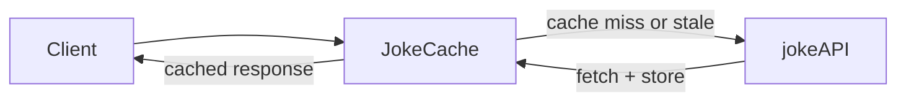

import Tabs from '@theme/Tabs';
import TabItem from '@theme/TabItem';

Every production application hits the same wall eventually: an external API you depend on is slow, rate-limited, or expensive to call. Harper's caching system lets you wrap any external data source — a REST API, a microservice, a database — and serve responses from a fast local cache while transparently fetching fresh data only when needed.

In this guide you will build a Harper application that caches responses from a public API, observe caching behavior using ETags and HTTP status codes, and learn how to invalidate entries on demand.

## What You Will Learn

- How to define a cache table using the `@table(expiration:)` schema directive
- How to wrap an external data source with a custom Resource class
- How to connect a data source to a cache table using `sourcedFrom`
- How to observe caching behavior through ETag and `304 Not Modified` responses
- How to manually invalidate a cached entry

## Prerequisites

- Completed [Install and Connect Harper](../getting-started/install-and-connect-harper)
- Completed [Create Your First Application](../getting-started/create-your-first-application)
- Working Harper installation (local or Fabric)
- A command-line HTTP client (`curl` recommended) or familiarity with `fetch`

## Setting Up the Application

Clone the example repository and open it in your editor. If you are using a container install, clone into the mounted `dev/` directory.

```bash
git clone https://github.com/HarperFast/caching-guide-example.git harper-caching
```

The repository has the following structure:

```
harper-caching/
├── config.yaml
├── schema.graphql
└── resources.js
```

Start Harper in dev mode from inside the directory:

```bash
harper dev .
```

## Defining a Cache Table

Open `schema.graphql`. The cache table is defined with a single addition to the familiar `@table` directive: an `expiration` argument.

```graphql
type JokeCache @table(expiration: 60) @export {
	id: ID @primaryKey
	setup: String
	punchline: String
}
```

The `expiration: 60` argument tells Harper that any record in this table is considered _stale_ after 60 seconds. When a stale record is requested, Harper fetches a fresh copy from the source resource and stores it before returning the response.

:::info
A table's `expiration` is measured in seconds. Harper also supports separate `eviction` and `scanInterval` arguments if you need fine-grained control over when records are physically removed from the table. See the [Schema reference](/reference/v5/database/schema) for details.
:::

## Wrapping an External Data Source

The source for the cache is a simple object in `resources.js`. The [public jokeAPI](https://official-joke-api.appspot.com/) returns a joke by ID as a JSON object — a perfect stand-in for any real external API.

```javascript
// resources.js

const jokeAPI= {
	async get(id) {
		const response = await fetch(`https://official-joke-api.appspot.com/jokes/${id}`);
		return response.json();
	}
}

tables.JokeCache.sourcedFrom(jokeAPI);
```

`sourcedFrom` registers `jokeAPI` as the upstream source for `JokeCache`. Harper's caching behavior now works as follows:

1. A request arrives for `/JokeCache/1`.
2. Harper checks if the record with id `1` exists in `JokeCache` and is not stale.
3. If it is fresh, Harper returns it immediately.
4. If it is missing or stale, Harper calls `jokeAPI.get()` to fetch the data, stores it in `JokeCache`, and returns the result.

Multiple simultaneous requests for the same missing or stale record will all wait on a single upstream call — Harper prevents cache stampedes automatically.



## Configuring the Application

With the schema and resource in place, open `config.yaml` and enable the two plugins this application needs:

```yaml
graphqlSchema:
  files: 'schema.graphql'
rest: true
jsResource:
  files: 'resources.js'
```

- `graphqlSchema` loads `schema.graphql` and creates the `JokeCache` table.
- `rest` enables Harper's REST API on port `9926`, exposing any `@export`-ed tables and resources as HTTP endpoints.
- `jsResource` loads `resources.js`, registering the `jokeAPI` source and the `sourcedFrom` connection — as well as any exported Resource classes as endpoints.

Restart Harper (or let `harper dev` pick up the change automatically), then continue.

:::note
If you need to check your work, checkout the [`01-cached-api`](https://github.com/HarperFast/caching-guide-example/tree/01-cached-api) branch.
:::

## Making Your First Cached Request

With Harper running, fetch a joke:

<Tabs groupId="http-client">
  <TabItem value="curl">

```bash
curl -i 'http://localhost:9926/JokeCache/1'
```

  </TabItem>
  <TabItem value="fetch">

```typescript
const response = await fetch('http://localhost:9926/JokeCache/1');
console.log(response.status); // 200
console.log(response.headers.get('etag'));
const joke = await response.json();
console.log(joke);
```

  </TabItem>
</Tabs>

You should see a `200` response:

<Tabs groupId="http-client">
  <TabItem value="curl">

```
HTTP/1.1 200 OK
content-type: application/json
etag: "abCDefGHij"
...

{
  "id": 1,
  "type": "general",
  "setup": "What did the ocean say to the beach?",
  "punchline": "Nothing, it just waved."
}
```

  </TabItem>
  <TabItem value="fetch">

```
200
"abCDefGHij"
{ id: 1, type: 'general', setup: 'What did the ocean say to the beach?', punchline: 'Nothing, it just waved.' }
```

  </TabItem>
</Tabs>

Note the double quotes on the ETag — they are part of the value itself, not just string delimiters. You will need to include them when passing the ETag back in a request header.

Harper automatically computes an ETag from the record's last-modified timestamp. This is the key to downstream caching.

## Observing Caching Behavior with ETags

Make the same request again, this time passing the ETag back in the `If-None-Match` header:

<Tabs groupId="http-client">
  <TabItem value="curl">

```bash
# Use the etag value from the previous response, double quotes included
curl -i 'http://localhost:9926/JokeCache/1' \
  -H 'If-None-Match: "abCDefGHij"'
```

  </TabItem>
  <TabItem value="fetch">

```typescript
// Store the etag from the first request
const first = await fetch('http://localhost:9926/JokeCache/1');
const etag = first.headers.get('etag'); // e.g. "abCDefGHij"

// Second request using the etag
const second = await fetch('http://localhost:9926/JokeCache/1', {
	headers: { 'If-None-Match': etag },
});
console.log(second.status); // 304
```

  </TabItem>
</Tabs>

<Tabs groupId="http-client">
  <TabItem value="curl">

```
HTTP/1.1 304 Not Modified
etag: "abCDefGHij"
```

  </TabItem>
  <TabItem value="fetch">

```
304
```

  </TabItem>
</Tabs>

The response status will be `304 Not Modified` with an empty body. Harper compared the record's current ETag to the one you sent and found them identical — the data hasn't changed, so there's nothing to transfer.

This is standard HTTP conditional request behavior. Any HTTP cache layer between your client and Harper — a CDN, a service worker, or a browser cache — can use this same mechanism to avoid redundant data transfers.

:::info
The `ETag` / `If-None-Match` pattern is documented in detail in the [REST Headers reference](/reference/v5/rest/headers).
:::

## Watching Cache Expiration

The `JokeCache` table has a 60-second expiration. After 60 seconds, the cached record becomes stale and the next request will fetch a fresh copy from `jokeAPI`.

You can force this behavior immediately by passing the `no-cache` directive in the `Cache-Control` request header, which tells Harper to bypass the local cache and always go to the source:

<Tabs groupId="http-client">
  <TabItem value="curl">

```bash
curl -i 'http://localhost:9926/JokeCache/1' \
  -H 'Cache-Control: no-cache'
```

  </TabItem>
  <TabItem value="fetch">

```typescript
const response = await fetch('http://localhost:9926/JokeCache/1', {
	headers: { 'Cache-Control': 'no-cache' },
});
```

  </TabItem>
</Tabs>

You will see a `200` response, and if you check the Harper logs you will see an outbound request to `jokeAPI`.

## Invalidating a Cache Entry

Sometimes you know the source data has changed and you do not want to wait for the TTL to expire. Harper's Resource API exposes an `invalidate` method that marks a cached record as stale immediately, so it will be reloaded from the source on the next access.

First, remove the `@export` directive from the `JokeCache` schema:

```graphql
type JokeCache @table(expiration: 60) {
	id: ID @primaryKey
	setup: String
	punchline: String
}
```

Then, create an exported class of the same name in `resources.js` with a custom `POST` handler:

```javascript
export class JokeCache extends tables.JokeCache {
	static async post(target, data) {
		const body = await data;
		if (body?.action === 'invalidate') {
			this.invalidate(target);
			return { status: 200, data: { message: 'invalidated' } };
		}
	}
}
```

By exporting this class, Harper registers it as the endpoint for `/JokeCache`. The `@export` directive in the schema is no longer required separately because the export is provided by this class.

Now you can trigger invalidation with a `POST` request:

<Tabs groupId="http-client">
  <TabItem value="curl">

```bash
curl -X POST 'http://localhost:9926/JokeCache/1' \
  -H 'Content-Type: application/json' \
  -d '{"action": "invalidate"}'
```

  </TabItem>
  <TabItem value="fetch">

```typescript
await fetch('http://localhost:9926/JokeCache/1', {
	method: 'POST',
	headers: { 'Content-Type': 'application/json' },
	body: JSON.stringify({ action: 'invalidate' }),
});
```

  </TabItem>
</Tabs>

The next `GET /JokeCache/1` will trigger a fresh fetch from `jokeAPI` regardless of whether the TTL has expired.

:::note
If you need to check your work, checkout the [`02-invalidate-example`](https://github.com/HarperFast/caching-guide-example/tree/02-invalidate-example) branch.
:::

## Putting It All Together

Here is the complete `resources.js` for this guide:

```javascript
// resources.js

const jokeAPI = {
	async get() {
		const id = this.getId();
		const response = await fetch(`https://official-joke-api.appspot.com/jokes/${id}`);
		return response.json();
	}
}

tables.JokeCache.sourcedFrom(jokeAPI);

export class JokeCache extends tables.JokeCache {
	static async post(target, data) {
		const body = await data;
		if (body?.action === 'invalidate') {
			this.invalidate(target);
			return { status: 200, data: { message: 'invalidated' } };
		}
	}
}
```

And the complete `schema.graphql`:

```graphql
type JokeCache @table(expiration: 60) {
	id: ID @primaryKey
	setup: String
	punchline: String
}
```

## What Comes Next

This guide covered the passive caching pattern: Harper fetches from the source on demand and serves the cached copy until the TTL expires. The next guide, [Caching AI Generations with Harper](./caching-ai-generations), applies these same techniques to a real-world problem — caching expensive AI-generated content so that you don't pay for the same generation twice.

## Additional Resources

- [Database Schema](/reference/v5/database/schema) — `@table` directive and `expiration` argument
- [Resource API](/reference/v5/resources/resource-api) — `sourcedFrom`, `invalidate`, static and instance methods
- [REST Headers](/reference/v5/rest/headers) — ETag and `If-None-Match` conditional requests
- [REST Overview](/reference/v5/rest/overview) — HTTP methods and URL structure
- [react-ssr-example](https://github.com/HarperFast/react-ssr-example) — A full example using `sourcedFrom` to cache server-rendered HTML pages
