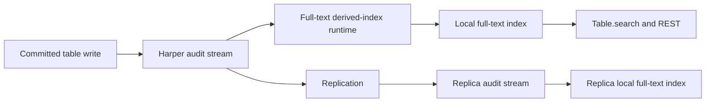

# Full-Text Search

<VersionBadge version="v5.3.0" /> <EngineBadge engines="RocksDB" />

Harper can build a BM25-ranked full-text index from one or more fields on a table. The index is declared in the table schema, updated from committed record changes, and queried through the same `Table.search()` and REST interfaces used for other Harper queries.

Use full-text search when users need relevance-ranked matching across product names, descriptions, tags, articles, or other natural-language fields. It supports term, all-term, phrase, prefix, fuzzy, and fuzzy-prefix matching.

## Requirements

- The table must use RocksDB and have [transaction logging enabled](../database/transaction.md#enabling-the-transaction-log-per-table). New schema tables must declare `@table(audit: true)`; omitting it or setting `audit: false` returns `400`. An existing table that already persisted audit logging can add a full-text field without restating the option, but disabling audit is rejected while an index is declared.
- Full-text source fields must be stored `String`, `[String]`, or `Blob` values. Blob sources must be declared as `text/plain`.
- Creating or updating an LMDB table with an `@fullText` field fails with `400`. A persisted declaration encountered while opening LMDB is ignored with a warning. Migrate the table to RocksDB before activating the index.

See [Configuration](./configuration.md) for the complete schema contract, [Querying](./querying.md) for search examples, and [Query optimization](../resources/query-optimization.md) for performance guidance.

## How it works

Full-text indexes are derived local state. The table records and schema remain the source of truth.

Each node builds its own index from committed transactions. Harper does not replicate full-text index files or include them in authoritative backups. After a restore or move to a node without compatible local files, Harper rebuilds the index before serving full-text queries.

The `@fullText` declaration must also exist on each node. A replicated component deployment or schema propagation can install it, but table-record replication alone only supplies the source records. Once the declaration is present, the node builds its own index.

This design has several consequences:

- A committed record can be visible before its derived full-text index has applied the same transaction. Queries use a bounded staleness policy, described in [Freshness controls](./querying.md#freshness-controls).
- A missing, corrupt, or incompatible index can be rebuilt from the table and audit stream without changing source records.
- If an index remains behind for more than 30 seconds, Harper rejects ordinary local writes to its table until the runtime catches up or changes lifecycle state. See [Write backpressure](#write-backpressure).

## Startup and recovery

On restart, Harper reuses compatible local index files and replays committed changes after the saved checkpoint. If those files are missing, incompatible, or corrupt, Harper rebuilds the index locally.

A rebuild captures a fresh committed-log boundary, scans the current table, and replays changes committed after that boundary. An unreadable or corrupt transaction log can make an attempt fail. The same applies when [transaction-log cleanup](../database/transaction.md#delete_transaction_logs_before) or automatic retention removes the history needed to bridge that scan to current writes. A later attempt captures a new boundary, so stopping aggressive cleanup can allow the rebuild to succeed without restoring already-purged history. Harper retries with backoff; after the retry budget is exhausted, readiness becomes `unavailable`. Inspect `describe_table` and the node logs for the reason before retrying activation.

Ordinary table reads and writes remain available during a rebuild. While readiness is `unknown`, `needs-rebuild`, or `rebuilding`, full-text queries return `503` with `code: "INDEX_REBUILDING"` and `retryable: true`. If rebuild attempts are exhausted and readiness becomes `unavailable`, queries return a generic, non-retryable `503` until an operator corrects the cause and retries activation. A new replica follows the same process after the full-text declaration reaches that node.

Use `describe_table` to inspect each index's declaration and readiness. See [Inspecting an index](./configuration.md#inspecting-an-index).

## Write backpressure

Harper allows a full-text index up to 30 seconds to absorb committed changes. If the runtime remains behind beyond that budget, ordinary local writes to the indexed table fail with `503`, `code: "DERIVED_INDEX_LAGGING"`, and `retryable: true`. This applies to writes through REST, the Operations API, and direct table calls from application code. Replication notifications, source applies, and crash-recovery replay continue so the authoritative data can converge.

Retry rejected writes with backoff rather than immediately adding more load. Inspect index readiness and node logs. Write admission resumes after the runtime proves durable catch-up or moves into another lifecycle state such as rebuilding or unavailable.

## Ranking and result loading

The native index ranks matching documents with BM25. Harper then loads the authoritative table records for the matching IDs and discards stale or deleted candidates. Selecting `$score` includes the relevance score in each result.

Full-text search can be combined with structured filters. Harper pushes compatible filters into candidate evaluation so selective filters do not silently under-fill a requested page.

## Limits and troubleshooting

- Phrase search requires `positions: true`; prefix and fuzzy-prefix require `surfaceTerms: true`.
- Prefix expressions have a 100-record native result window. Use a bounded `limit`; requests beyond the window fail instead of truncating silently.
- One query can use only one full-text index. An `or` group cannot mix full-text and ordinary record conditions.
- Each Blob source is limited to 1 MiB (1,048,576 bytes). Invalid UTF-8 or an oversized Blob removes the entire record from the index, including its other full-text source fields, until valid content is indexed.
- `INDEX_REBUILDING` is transient and retryable. `DERIVED_INDEX_LAGGING` can mean a query coverage wait expired or local writes were shed after prolonged index lag. `unavailable` means automatic rebuild attempts were exhausted or activation failed; inspect readiness and logs rather than retrying every `503` indefinitely.
- Generated GraphQL field arguments remain equality conditions; use `Table.search()`, REST, or `search_by_conditions` for full-text comparators.

See [Querying](./querying.md) for exact condition rules and [Configuration](./configuration.md#inspecting-an-index) for readiness details.

## Stored index data

The local index stores tokenized terms, posting lists, optional positions and surface terms, and checkpoint metadata. It does not store an authoritative copy of each record. Harper always loads current table records before returning results, and it can discard and rebuild this derived state from committed data.

Protect the index directory with the same filesystem controls as Harper data. Deleted source terms can remain in obsolete Tantivy segment files until normal merge and reclamation removes them; removal from query results does not imply immediate physical erasure.
