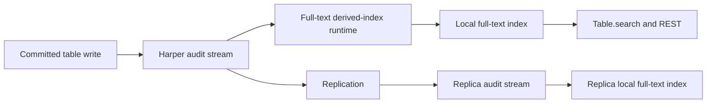

# Full-Text Search

<VersionBadge version="v5.3.0" />

Harper can build a BM25-ranked full-text index from one or more fields on a table. The index is declared in the table schema, updated from committed record changes, and queried through the same `Table.search()` and REST interfaces used for other Harper queries.

Use full-text search when users need relevance-ranked matching across product names, descriptions, tags, articles, or other natural-language fields. It supports term, all-term, phrase, prefix, fuzzy, and fuzzy-prefix matching.

## Requirements

- The table must use RocksDB and have `audit: true`. <EngineBadge engines="RocksDB" />
- Full-text source fields must be stored `String`, `[String]`, or `Blob` values. Blob sources must be declared as `text/plain`.
- Creating or updating an LMDB table with `@fullText` fails with `400`. A persisted declaration encountered while opening LMDB is ignored with a warning. Migrate the table to RocksDB before activating the index.

See [Configuration](./configuration.md) for the complete schema contract, [Querying](./querying.md) for search examples, and [Query optimization](../resources/query-optimization.md) for performance guidance.

## How it works

Full-text indexes are derived local state. The table records and schema remain the source of truth.

Each node builds its own index from committed transactions. Harper does not replicate full-text index files or include them in authoritative backups. After a restore or move to a node without compatible local files, Harper rebuilds the index before serving full-text queries.

This design has two consequences:

- A committed record can be visible before its derived full-text index has applied the same transaction. Queries use a bounded staleness policy, described in [Freshness controls](./querying.md#freshness-controls).
- A missing, corrupt, or incompatible index can be rebuilt from the table and audit stream without changing source records.

## Startup and recovery

On restart, Harper reuses compatible local index files and replays committed changes after the saved checkpoint. If those files are missing, incompatible, or corrupt, Harper rebuilds the index locally.

Ordinary table reads and writes remain available during a rebuild. Full-text queries return `503` with `code: "INDEX_REBUILDING"` and `retryable: true` until the index is ready. A new replica follows the same process before serving full-text queries.

Use `describe_table` to inspect each index's declaration and readiness. See [Inspecting an index](./configuration.md#inspecting-an-index).

## Ranking and result loading

The native index ranks matching documents with BM25. Harper then loads the authoritative table records for the matching IDs and discards stale or deleted candidates. Selecting `$score` includes the relevance score in each result.

Full-text search can be combined with structured filters. Harper pushes compatible filters into candidate evaluation so selective filters do not silently under-fill a requested page.

## Stored index data

The local index stores tokenized terms, posting lists, optional positions and surface terms, and checkpoint metadata. It does not store an authoritative copy of each record. Harper always loads current table records before returning results, and it can discard and rebuild this derived state from committed data.
